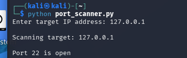

# Python Port Scanner

## Overview
This project demonstrates a basic Python port scanner built with the socket library. It scans ports 1–1024 on a target host and reports open ports.

## Objective
Use Python to identify open ports on a target system and demonstrate basic networking and socket programming concepts.

## Tools Used
- Python 3
- Kali Linux
- socket library

## How It Works
The script prompts the user for a target IP address, then attempts to connect to ports 1 through 1024. If a connection succeeds, the port is reported as open.

## Code
```python
import socket

target = input("Enter target IP address: ")

print(f"\nScanning target: {target}\n")

for port in range(1, 1025):
    s = socket.socket(socket.AF_INET, socket.SOCK_STREAM)
    s.settimeout(0.5)

    result = s.connect_ex((target, port))

    if result == 0:
        print(f"Port {port} is open")

    s.close()
## Screenshot

